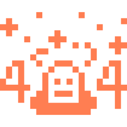

# 🎯 Capstone Quiz App

An interactive and dynamic quiz application built with **React**. Test your knowledge across various categories with different difficulty levels. The app features engaging UI, real-time feedback, and responsive design for both desktop and mobile users.

---

## 🚀 **Features**

- ✅ Dynamic quiz questions fetched from the Open Trivia API  
- ✅ Multiple categories and difficulty levels  
- ✅ Instant feedback on answers  
- ✅ Score tracking with visual success/failure feedback  
- ✅ Fully responsive design for mobile and desktop  
- ✅ Error handling with a custom 404 page  

---

## 🖼️ **Screenshots**

### ✅ Success Screen  


### ❌ Failure Screen  


### ⚠️ 404 Not Found  


---

## 🔧 **Tech Stack**

- **Frontend:** React, Tailwind CSS, Custom CSS  
- **API:** [Open Trivia API](https://opentdb.com/)  
- **Icons/Images:** Custom SVG icons  

---

## 📦 **Installation & Setup**

1. **Clone the repository:**

   ```bash
   git clone https://github.com/HALAYOUNIS-21/Capstone.git
   cd Capstone

2.	** Install dependencies: **

npm install

3.	** Run the application:**

npm run dev

4.	**Visit the App:**

Open http://localhost:5173 in your browser.


## 🗂️ Project Structure

Capstone/
├── public/
│   └── images/
│       ├── 404.png
│       ├── add.svg
│       ├── sub.svg
│       ├── skull.svg
│       └── trophy.svg
├── src/
│   ├── Components/
│   │   ├── Header.jsx
│   │   └── Header.css
│   ├── Pages/
│   │   ├── Home.jsx
│   │   ├── Quiz.jsx
│   │   ├── Results.jsx
│   │   └── NotFound.jsx
│   └── Styles/
│       ├── index.css
│       ├── quiz.css
│       ├── results.css
│       └── notfound.css
├── package.json
└── README.md


## ✨ Future Enhancements
	•   📊 Add a leaderboard to track top scores
	•	⏲️ Implement timer-based quizzes
	•	📝 Include more question types (True/False, Fill-in-the-blank)
	•	🌙 Dark mode toggle


## 📬 Contact

Hala Younis
📧 Email: [Halayounis.a@gmail.com]
🔗 GitHub: HALAYOUNIS-21
